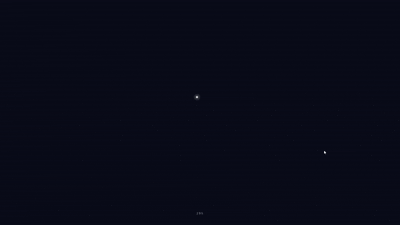

# Dot said

**Esperienza web interattiva in Three.js**

*Dare forma al sesto senso attraverso le parole che non diciamo ad alta voce.*

Dot said nasce da una domanda:

> se il sesto senso fossero tutte le cose, che non siamo capaci di dire ad alta voce per paura?

<p align="center">
  
</p>

Il progetto immagina il sesto senso come uno spazio digitale in cui il non detto può diventare visibile. L’utente scrive fino a dieci parole, le vede disperdersi nello spazio e le ricompone in una costellazione personale. Una volta completata, la costellazione viene lanciata in un sistema di pianeti-emozione, dove entra in relazione con frasi e tracce appartenenti a una dimensione collettiva.

Concept, design e sviluppo: **Nicole Somma**.

---

## Il progetto

Dot said è un’esperienza interattiva sul rapporto tra linguaggio, emozione e spazio.

L’obiettivo non è interpretare le parole dell’utente, ma trasformarle in una forma visiva e temporanea. Ogni parola inserita diventa una stella; ogni collegamento costruisce una costellazione; ogni scelta emotiva apre un cielo abitato da frasi tematiche.

Il progetto lavora quindi su due livelli:

| Livello | Descrizione |
|---|---|
| Personale | Le parole dell’utente diventano una costellazione |
| Collettivo | Le frasi della community popolano i cieli dei pianeti-emozione |

---

## Flusso dell’esperienza

L’esperienza si sviluppa in sette passaggi principali:

1. **Loading**  
   La pagina apre un cielo scuro con una particella luminosa, una percentuale di caricamento e il reveal del logo `dot said`.

2. **Intro**  
   Compare la domanda sul sesto senso e sul non detto. L’utente prosegue con un click o con tastiera.

3. **Scrittura**  
   Il prompt chiede:

   > cosa ti va di non dire?

   L’utente può inserire fino a dieci parole.

4. **Dispersione**  
   Le parole vengono disperse nello spazio e trasformate in stelle selezionabili.

5. **Costellazione**  
   Cliccando sulle stelle, l’utente collega le parole e costruisce la propria costellazione.

6. **Lancio**  
   La costellazione viene inviata nello spazio e diventa parte del paesaggio visivo.

<p align="center">
  
</p>

7. **Pianeti-emozione**  
   L’utente sceglie uno tra otto pianeti emotivi:

   - gratitudine
   - felicità
   - desiderio
   - empatia
   - malinconia
   - tristezza
   - paura
   - rabbia

   Dopo la scelta, entra in un cielo 2D navigabile con frasi e costellazioni associate all’emozione selezionata.

---

## Funzionalità principali

Questa versione include:

- schermata di caricamento con particella centrale e reveal del logo;
- audio ambientale introduttivo e feedback sonori;
- cursore luminoso custom su desktop;
- input testuale con limite di 10 parole;
- trasformazione delle parole in stelle cliccabili;
- costruzione manuale della costellazione;
- sistema di 8 pianeti-emozione;
- cielo del pianeta in Canvas 2D;
- navigazione con pan, inerzia e zoom;
- download PNG della propria costellazione o della vista del pianeta;
- pannello About apribile da `beyond the stars`.

L’entry point reale dell’app è:

```text
index.html
```

---

## Dati e contenuti

I contenuti principali si trovano nella cartella `data/`.

| File | Funzione |
|---|---|
| `data/frasi-sesto-senso.json` | Dataset principale delle frasi curate per i pianeti |
| `data/frasi-sesto-senso.js` | Versione caricabile dal browser |
| `data/community-phrases.json` | Frasi community di fallback |
| `data/community-phrases.js` | Versione browser delle frasi community |
| `data/emotions.json` | Lessico e associazioni semantiche sperimentali |
| `data/config.json` | Parametri di camera, stelle, audio, controlli e UI |

La pagina corrente carica direttamente:

```html
<script src="./data/community-phrases.js"></script>
<script src="./data/frasi-sesto-senso.js"></script>
```

I dati vengono esposti nel browser tramite:

```js
window.SESTOSENS_DATA.communityPhrases
window.SESTOSENS_DATA.frasiSestoSenso
```

Se modifichi i file `.json`, rigenera i file `.js` con:

```bash
node scripts/generate-data-js.mjs
```

---

## Stack tecnico

- **Three.js 0.182.0** via import map CDN;
- **OrbitControls** per rotazione, zoom e navigazione camera;
- **CSS2DRenderer** per etichette nello spazio 3D;
- **Canvas 2D** per loading, texture procedurali, export e cielo del pianeta;
- **Web Audio API** e tag `<audio>` per suoni ambientali e feedback;
- **JavaScript ES modules** per la logica Three.js dentro `index.html`;
- **Python/Node scripts** per generazione dati, bundle e asset esportati.

Nota: l’app usa Three.js da CDN (`jsdelivr`). Per lavorare offline serve sostituire l’import map con una copia locale della libreria.

---

## Avvio locale

Serve un browser moderno con WebGL.  
Aprire direttamente il progetto con `file://` è sconsigliato: audio, moduli e asset funzionano meglio tramite server locale.

### Metodo rapido su Windows

Fai doppio click su:

```text
apri.bat
```

Lo script cerca Python, avvia un server locale sulla porta `8765` o sulla prima porta libera successiva, e apre:

```text
http://127.0.0.1:8765/index.html
```

In alternativa:

```powershell
powershell -ExecutionPolicy Bypass -File apri.ps1
```

### Metodo manuale

Su Windows:

```bash
py -3 -m http.server 8765
```

Su macOS o Linux:

```bash
python3 -m http.server 8765
```

Poi apri:

```text
http://127.0.0.1:8765/index.html
```

---

## Script utili

Rigenera i file `data/*.js` a partire dai rispettivi `.json`:

```bash
node scripts/generate-data-js.mjs
```

Ricostruisce `data/frasi-sesto-senso.json` dal dataset curato nello script:

```bash
py -3 scripts/build-frasi-sesto-senso.py
```

Esporta `sfondo-dot-said.png`, uno sfondo stellato ad alta risoluzione:

```bash
py -3 scripts/export-sfondo.py
```

Genera un bundle sperimentale del flusso modulare in `js/`. Non è necessario per avviare la pagina corrente:

```bash
node scripts/build-bundle.mjs
```

---

## Struttura

```text
3d-globe-stars-threejs-main/
|-- index.html
|-- Dotnation.ttf
|-- star 1.mp3
|-- star2.mp3
|-- apri.bat
|-- apri.ps1
|-- data/
|   |-- frasi-sesto-senso.json
|   |-- frasi-sesto-senso.js
|   |-- community-phrases.json
|   `-- community-phrases.js
|-- js/
|-- src/
|-- scripts/
|-- public/
`-- assets/
```

---

## Note di manutenzione

- La versione navigabile oggi è `index.html`.
- Le cartelle `src/` e `js/` contengono prototipi, moduli e bundle di supporto.
- I pianeti sono generati proceduralmente con Canvas e Three.js.
- I dati vengono letti da `window.SESTOSENS_DATA`, popolato dagli script in `data/*.js`.
- Se cambi i file `.json`, rigenera i corrispondenti `.js`.
- Il download genera file PNG direttamente nel browser.

---

## Crediti

**Autrice:** Nicole Somma <br>
**Email:** nicolesomma26@gmail.com <br>
**Instagram:** @__nicolesomma__ <br>
**Font**: Dotnation, Andale Mono <br>
**Audio**: `star 1.mp3`, `star2.mp3`<br>
**Rendering**: Three.js, Canvas 2D, Web Audio API <br>

---

*Dot said è uno spazio per lasciare andare quello che non diresti.*
